# AP Statistics Learning Flow

This diagram shows the recommended workflow for students using the AP Statistics learning platform with Grok AI tutoring.

```mermaid
flowchart TD
    A["🎯 Start Learning Session"] --> B["📚 Choose Lesson Topic"]
    B --> C["📄 Download Study PDF"]
    C --> D["🤖 Open Grok in New Tab"]
    D --> E["📤 Upload PDF to Grok"]
    E --> F["💬 Use Starter Prompt"]
    F --> G["🧠 Study with AI Tutor"]

    G --> H{"Need More Help?"}
    H -->|Yes| I["❓ Ask Follow-up Questions"]
    H -->|No| J["🔄 Return to Web App"]

    I --> K["📝 Request Practice Problems"]
    K --> L["✅ Work Through Solutions"]
    L --> H

    J --> M["🎯 Take Interactive Quiz"]
    M --> N["📊 Check Progress Tracker"]
    N --> O{"Ready for Next Lesson?"}

    O -->|Yes| B
    O -->|No| P["📖 Review Current Material"]
    P --> C

    style A fill:#e1f5fe
    style G fill:#f3e5f5
    style M fill:#e8f5e8
    style N fill:#fff3e0
```

## Workflow Explanation

### Phase 1: Content Discovery

- **Choose Lesson**: Browse available AP Statistics topics
- **Download PDF**: Get comprehensive study materials for the selected lesson

### Phase 2: AI-Powered Learning

- **Open Grok**: Launch the AI tutoring platform
- **Upload Materials**: Share the lesson PDF with your AI tutor
- **Start Session**: Use the provided starter prompt for optimal tutoring

### Phase 3: Interactive Study

- **Study with Tutor**: Engage in personalized learning conversations
- **Ask Questions**: Get clarification on difficult concepts
- **Practice Problems**: Work through AI-generated exercises

### Phase 4: Assessment & Progress

- **Return to App**: Come back to the main learning platform
- **Take Quiz**: Test your understanding with interactive questions
- **Track Progress**: Monitor your learning journey and pace

### Phase 5: Continuous Learning

- **Evaluate Readiness**: Decide whether to advance or review
- **Iterate**: Repeat the cycle for mastery or move to new topics

## Key Benefits

- **Personalized Learning**: AI tutor adapts to your specific needs
- **Comprehensive Materials**: High-quality PDFs cover all essential concepts
- **Progress Tracking**: Monitor your advancement through the curriculum
- **Flexible Pacing**: Learn at your own speed with built-in review cycles

---

_This workflow is designed to maximize learning efficiency while providing multiple touchpoints for reinforcement and assessment._
